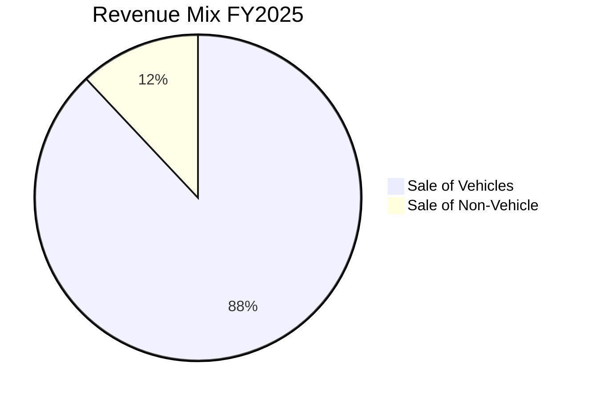
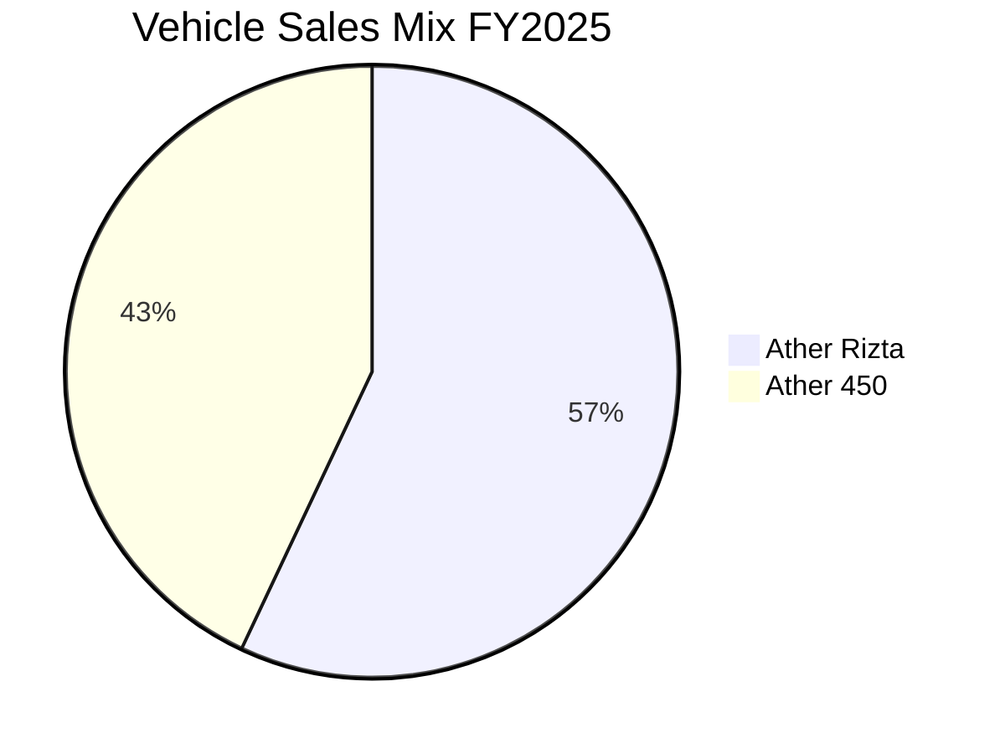

### **Business Snapshot & Model**

Ather Energy Limited is a pure-play electric vehicle (EV) company in India, specializing in the design, manufacturing, and sale of high-performance electric two-wheelers (E2Ws) and their associated ecosystem. Founded in 2013 at IIT Madras, the company focuses on a vertically integrated approach, designing key hardware components and the entire software stack in-house. This strategy provides deep control over product quality, performance, and user experience. Ather's product portfolio includes the performance-oriented Ather 450 series and the family-focused Ather Rizta series. Beyond vehicles, the company has built a comprehensive ecosystem that includes its proprietary "AtherStack" software for connected features, the "Ather Grid" fast-charging network, and a range of smart accessories. The company operates with an asset-light distribution model through retail partners and has manufacturing facilities in Hosur, Tamil Nadu, with a new plant under development in Maharashtra.

**Main Products, Services, and Customer Segments**

| Category | Item | Description | Customer Segment |
| :--- | :--- | :--- | :--- |
| **Products** | **Ather 450 Range** | A series of high-performance electric scooters including the 450S, 450X (LR & HR variants), and the top-of-the-line 450 Apex. | Performance enthusiasts and tech-savvy urban commuters. |
| | **Ather Rizta Range** | A family-oriented electric scooter focused on convenience, comfort, and storage, available in S and Z variants (LR & HR). | Families and customers prioritizing practicality and convenience. |
| | **Accessories** | Smart accessories including the Halo smart helmet, Halo Bit, Tyre Pressure Monitoring System (TPMS), seat covers, and storage solutions. | All Ather customers. |
| **Services & Ecosystem** | **AtherStack Software** | An in-house developed software platform providing features like on-dash navigation, over-the-air (OTA) updates, ride statistics, and connectivity. | All Ather customers, with advanced features available via the Pro Pack. |
| | **Ather Grid** | India's largest E2W fast-charging network, with 3,611 chargers across 360+ cities, designed to reduce charging anxiety. | All EV users (interoperable via LECCS standard), primarily Ather customers. |
| | **Retail & Service Network** | A network of 375 Experience Centres and 282 Service Centres across India, Nepal, and Sri Lanka for sales and after-sales support. | Potential and existing Ather customers. |

**Value Chain**

Ather Energy employs a vertically integrated and capital-efficient value chain:
1.  **Research & Design:** The process begins with strong in-house R&D, which constitutes 46% of the company's on-roll employees. The company designs 80% of key hardware (chassis, battery packs, BMS, motor controller) and 100% of its software (AtherStack) internally. This control allows for rapid innovation and cost optimization.
2.  **Sourcing & Supply Chain:** Key components like lithium-ion cells and semiconductors are procured from large global technology players through direct arrangements. For other components, the company relies on a diversified base of 213 domestic vendors, with 65% of components being multi-sourced to de-risk the supply chain.
3.  **Manufacturing:** Component manufacturing is outsourced. The final assembly of vehicles and the manufacturing of battery packs are done in-house at its facility in Hosur, Tamil Nadu. This plant has an installed capacity of 420,000 E2Ws and 379,800 battery packs per year.
4.  **Distribution & Sales:** The company uses a three-tier, asset-light retail model. Sales are conducted through Experience Centres operated primarily by retail partners. This model minimizes capital expenditure for the company while leveraging the regional expertise of its partners.
5.  **After-Sales Service:** A network of Service Centres, including "ExpressCare" for 60-minute periodic maintenance, provides after-sales support. The software-defined ecosystem allows for continuous feedback and OTA updates, enhancing the post-purchase experience.

**Revenue Breakdown**

| Revenue Source | FY2025 (%) | FY2024 (%) |
| :--- | :--- | :--- |
| Sale of Vehicles | 88% | 90% |
| Sale of Non-Vehicle (Services, Accessories, etc.) | 12% | 10% |

*Revenue breakdown by geography is not disclosed in the report.*

**Core Revenue Streams, Key Inputs, and Cost Drivers**

*   **Core Revenue Streams:** The primary revenue stream is the sale of electric scooters. Additional revenue is generated from the sale of the AtherStack Pro Pack (unlocking advanced software features, contributing 6% of revenue), accessories, spare parts, and services.
*   **Key Raw Materials & Suppliers:** The most critical raw material is lithium-ion cells. The company has a diversified supplier base of 213 vendors, with 99% of E2W components (by BOM value, excluding cells) procured domestically.
*   **Distribution Channels:** An asset-light network of 375 dealer-owned and operated Experience Centres across India, Nepal, and Sri Lanka.
*   **Major Cost Drivers:** The largest cost driver is the **Cost of Materials Consumed**, accounting for 79% of total income in FY25. Other significant costs include **Employee Benefits Expense** (18% of total income) and **Other Expenses** (24% of total income), which includes marketing, freight, and R&D.

**Structural Changes During the Year**

*   The company changed its status from a private limited company to a public limited company effective August 27, 2024.
*   Post the financial year end, the company successfully launched its Initial Public Offering (IPO) and its equity shares were listed on the BSE Limited and National Stock Exchange of India Limited on May 6, 2025.

### **Chairman/Managing Director’s Letter**

*   **Overall Tone:** The letter from the founders, Tarun Sanjay Mehta and Swapnil Babanlal Jain, is **Optimistic and Confident**. They describe the shift to electric mobility as a "structural shift" and position Ather as a key player that has shaped the Indian E2W market through its commitment to in-house engineering and building a complete ecosystem.

*   **Key Achievements Highlighted:**
    *   The E2W market showed resilience and clarity despite significant policy changes and subsidy corrections in FY25.
    *   Vehicle sales volumes grew by 42% YoY, from 109,577 units in FY24 to 155,394 units in FY25.
    *   The successful launch of the Ather Rizta, the company's first family scooter, significantly boosted volumes and market share.
    *   Ather emerged as the market leader in South India in Q4 FY25, capturing 22% of sales in the region.
    *   Rapid scaling of the distribution network to take products to all parts of the country.

*   **Stated Strategic Priorities:**
    *   "As we look to the future, our focus will remain on achieving excellence in EV design and manufacturing, creating leading-edge products, and enhancing the EV ecosystem."
    *   Diversify the product portfolio with new scooter and motorcycle products built on the developing EL and Zenith platforms.
    *   Scale manufacturing by kick-starting work on a new factory in Maharashtra to ensure future readiness.
    *   Widen the distribution network by expanding rapidly across West, North, and East India.
    *   "We are firmly on track to becoming a profitable, pan-India EV brand."

*   **Primary Challenges or Headwinds Mentioned:**
    *   The letter acknowledges past headwinds, stating, "FY25 marked a pivotal year for the electric two-wheeler (E2W) market in India. Despite significant policy changes and subsidy corrections, the market showed both resilience and clarity." It does not specify future challenges but alludes to the competitive nature of the market.

### **Industry & Macro Overview**

**Industry Environment and Demand Drivers**

*   **Market Size:** India is one of the world's largest two-wheeler (2W) markets, with domestic sales reaching approximately 20 million units in FY25. The electric two-wheeler (E2W) segment is one of the fastest-growing segments, with sales of 1.15 million units in FY25, a 23% increase from FY24.
*   **EV Penetration:** E2W penetration in the overall 2W market reached 5.8% in FY25. Scooters are leading the electrification trend, with 15.7% of all scooters sold in FY25 being electric.
*   **Growth Projections:** The E2W market is projected to grow at a CAGR of ~41% over the next five years. By FY31, E2Ws are anticipated to account for ~35% of total 2W sales, with penetration in the scooter segment expected to reach as high as 70%.
*   **Demand Drivers:**
    *   **Government Support:** Policies and incentives promoting EV adoption.
    *   **Superior TCO:** A significantly lower Total Cost of Ownership for EVs compared to ICE vehicles (52% lower as of FY25).
    *   **Customer Awareness:** Growing awareness of the benefits of electric mobility.
    *   **Product Availability:** A larger portfolio of EV products from both established and new-age OEMs.
    *   **Infrastructure:** Expanding charging infrastructure, which helps reduce range anxiety.
    *   **Premiumisation Trend:** A clear trend in the 2W industry towards higher-capacity (≥125cc) vehicles, which aligns with the performance capabilities of premium E2Ws.

**Key Challenges**

*   The report mentions that the industry has navigated challenges related to policy changes and subsidy corrections.
*   Competition is a key factor, with both legacy players and new entrants expanding their EV portfolios.

**Company’s Relative Positioning**

*   Ather Energy was the 4th largest E2W manufacturer in India by sales volume as of March 31, 2025.
*   The company achieved a national market share of 11.4% in FY25.
*   It holds a strong position in South India, with a market share of 19.7%, and became the market leader in the region in Q4 FY25 with a 22% share.

### **Financial Statement Analysis (Consolidated)**

The company does not have any subsidiaries, joint ventures, or associate companies. Therefore, the consolidated financial statements are the same as the standalone financial statements.

| Metric | FY2025 | FY2024 | FY2023 |
| :--- | :--- | :--- | :--- |
| **Revenue from Operations (₹ Mn)** | 22,550 | 17,538 | 17,809 |
| **EBITDA (₹ Mn)** | (5,307) | (6,494) | (6,867) |
| **Net Profit (Profit After Tax) (₹ Mn)** | (8,123) | (10,597) | (8,645) |
| **Basic EPS (₹)** | (32) | (47) | Not Disclosed in Report |
| **EBITDA Margin %** | (23%) | (36%) | (38%) |
| **Net Profit Margin %** | (35%) | (59%) | (48%) |
| **ROE %** | (156%) | (183%) | Not Disclosed in Report |
| **ROCE %** | Not Disclosed in Report | Not Disclosed in Report | Not Disclosed in Report |
| **Debt-to-Equity Ratio** | 1.26 | 0.88 | Not Disclosed in Report |

**Trends Summary:**

Revenue from operations grew by 29% in FY25, driven by a 42% increase in vehicle sales volumes following the launch of the Ather Rizta. The company demonstrated significant improvement in profitability, with EBITDA and Net Loss margins narrowing considerably due to ongoing cost reduction initiatives, better operating leverage from higher volumes, and strategic sourcing. The Debt-to-Equity ratio increased as the company raised additional debt to fund its operational requirements and capital expenditure for expansion, while its equity base was eroded by continued losses.

### **Financial Statement Analysis (Standalone)**

The company has no subsidiaries. The standalone financial results are the same as the consolidated results presented on the previous page.

**Trends Summary:**

Not applicable, as standalone performance is identical to consolidated performance.

### **Segment & Geography Performance**

**Segment-wise Performance (FY2025)**

The company's revenue can be analyzed by product sales vs. non-vehicle sales. A detailed profitability breakdown by segment is not disclosed.

**Revenue by Source (FY2025)**

| Segment | Revenue (₹ Mn) | % of Total Revenue |
| :--- | :--- | :--- |
| Sale of Vehicles | 19,984 | 88% |
| Sale of Non-Vehicle | 2,566 | 12% |
| **Total** | **22,550** | **100%** |

**Vehicle Sales by Model (FY2025)**

| Model | Units Sold | % of Total Sales |
| :--- | :--- | :--- |
| Ather Rizta | 88,869 | 57% |
| Ather 450 Range | 66,525 | 43% |
| **Total** | **155,394** | **100%** |

**Geography-wise Performance**

A detailed revenue breakdown by geography is not disclosed in the report. However, the company has provided its market share in key regions for FY2025.

**Market Share Growth in FY2025 (Quarterly)**
```mermaid
lineChart
    title Quarterly Market Share (%) - FY2025
    x: ["Q1", "Q2", "Q3", "Q4"]
    "India" : [7.6, 12.1, 12.3, 13.6]
    "South India" : [13.2, 19.1, 21.7, 22.0]
    "Gujarat" : [4.9, 13.5, 17.2, 19.6]
    "Maharashtra" : [4.8, 9.9, 9.5, 9.4]
```
| Region | Q1 FY25 Market Share (%) | Q4 FY25 Market Share (%) | Comment |
| :--- | :--- | :--- | :--- |
| **India (National)** | 7.6% | 13.6% | Steady growth through the year. |
| **South India** | 13.2% | 22.0% | Became market leader in Q4. |
| **Karnataka** | 19.0% | 25.8% | Became market leader in Q4. |
| **Kerala** | 16.4% | 32.2% | Became market leader in Q4. |
| **Gujarat** | 4.9% | 19.6% | Significant market share gains. |
| **Maharashtra** | 4.8% | 9.4% | Doubled market share during the year. |
| **Delhi** | 7.0% | 12.2% | Strong growth in the capital region. |

### **Shareholding Pattern**

**Shareholding Pattern as on March 31, 2025 (Pre-IPO)**

| Category | Holding (%) |
| :--- | :--- |
| **Promoter & Promoter Group** | **15.01%** |
| - Promoter | 14.11% |
| - Promoter Group | 0.90% |
| **Institutional Holding** | **78.82%** |
| - Corporate Bodies | 39.60% |
| - Foreign Company | 23.79% |
| - Alternate Investment Funds | 14.89% |
| - Other Bodies Corporate | 0.54% |
| **Retail & Public Holding** | **6.17%** |
| - Firms | 4.82% |
| - Public | 0.98% |
| - Non-Resident Indians (Non-Repatriable & Repatriable) | 0.37% |
| **Total** | **100.00%** |

**Major Changes During the Year:**

*   On March 8, 2025, the company converted a significant number of outstanding Compulsorily Convertible Preference Shares (CCPS) from various series into 240,483,445 equity shares.
*   The company also issued bonus shares and allotted shares upon the exercise of stock options during the year.
*   The shareholding pattern changed significantly post the financial year end due to the Initial Public Offering (IPO) in May 2025.

### **Capital Allocation, Dividend & Cash Flow**

*   **Capex:**
    *   **Capex during FY25:** The company incurred capital expenditure of **₹3,390 million** on Property, Plant, and Equipment (PPE) and intangible assets.
    *   **Planned Capex:** The company has initiated the first phase of "Factory 3.0" in Chhatrapati Sambhaji Nagar, Maharashtra. This phase will add 0.5 million E2Ws of annual production capacity and is planned to commence production in phases during FY27.

*   **Dividend:**
    *   In view of the losses for the financial year, the Board of Directors has not recommended any dividend for FY25. The company has not declared any dividend in the past.

*   **Equity Actions:**
    *   The company undertook several equity actions in FY25, including the issuance of bonus shares, allotment of shares upon exercise of employee stock options, and conversion of various series of Compulsorily Convertible Preference Shares (CCPS) into equity shares.
    *   Post FY25, the company raised **₹26,260 million** through a fresh issue of equity shares in its Initial Public Offering (IPO).

*   **Debt Levels:**
    *   **Gross Debt:** Increased to **₹4,499 million** as of March 31, 2025, from ₹3,149 million as of March 31, 2024.
    *   **Net Debt:** The company moved from a net cash position of ₹4,251 million in FY24 to a net debt position of **₹385 million** in FY25, reflecting increased borrowings and utilization of cash for operations and capex.
    *   **Debt/Equity Movement:** The Debt-to-Equity ratio increased from **0.88** in FY24 to **1.26** in FY25.

*   **Cash Flow Summary (FY2025):**

| Particulars | Amount (₹ Mn) |
| :--- | :--- |
| **Cash Flow from Operating Activities (CFO)** | **(7,207)** |
| **Cash Flow from Investing Activities (CFI)** | **(3,782)** |
| **Cash Flow from Financing Activities (CFF)** | **7,029** |
| **Net (Decrease)/Increase in Cash & Cash Equivalents** | (3,960) |

*   **CFO vs. Net Profit Check:** CFO of (₹7,207) million is greater (less negative) than the Net Profit of (₹8,123) million.

*   **Key Takeaways:**
    *   Cash was primarily generated from financing activities, including proceeds from current borrowings (net ₹5,830 million) and non-current borrowings (net ₹1,517 million).
    *   This cash was utilized to fund the net cash outflow from operations (₹7,207 million) and for capital expenditure on new facilities and R&D (₹3,782 million).
    *   The company's debt level increased significantly during the year to support its growth and expansion plans.

### **Management Discussion & Analysis Snapshot**

**Operational Performance Review**

Management attributes the operational performance in FY25 to strong execution on both product and distribution fronts. The launch of the Ather Rizta was a key driver, successfully targeting the larger convenience scooter segment and accounting for 57% of total sales. This product launch, combined with an aggressive expansion of the distribution network (growing from 265 stores in Q3 to 351 stores by the end of Q4), enabled the company to achieve a 42% YoY growth in sales volume. Margin improvements were a result of a multi-pronged strategy focusing on cost reduction through in-house design, leveraging increased scale for better sourcing, and maintaining premium pricing.

**Key Performance Indicators (KPIs)**

| KPI | FY2025 |
| :--- | :--- |
| Scooters Sold | 155,394 units |
| Total Kilometres Covered by Scooters | 4 billion+ |
| Charging Network Size (Global) | 3,611 chargers |
| Experience Centres (Global) | 375 centres |
| Service Centres (Global) | 282 centres |
| National Market Share | 11.4% |
| R&D Employees (% of total) | 46% |
| On-roll Employees | 1,617 |

**Demand & Outlook Commentary**

Management holds a positive outlook on the E2W industry, projecting it to grow at a CAGR of ~41% to reach ~35% of the total 2W market by FY31. They believe scooters will continue to lead this transition, with EV penetration in the scooter segment expected to reach 70-75% by FY31. Management states that Ather is "well-positioned to capitalise on this growth" due to its diverse product line catering to both performance and convenience segments, its strong R&D foundation, and its rapidly expanding manufacturing and distribution capabilities. The company aims to become a "profitable, pan-India EV brand."

**Strategic Initiatives**

*   **Product Expansion:** Developing two new vehicle platforms, the **EL platform** (a cost-effective scooter platform) and the **Zenith platform** (a motorcycle platform targeting the 125cc-300cc segment).
*   **Manufacturing Expansion:** Building **Factory 3.0** in Maharashtra, which will add 1.42 million units of capacity in phases and enable backward integration of processes like transmission assembly, electronics assembly, and painting.
*   **Distribution Growth:** Continuing the rapid expansion of the retail network, with a focus on deepening presence in the South and increasing penetration in the North, West, and East markets, particularly in Tier 2, 3, and 4 cities.
*   **Unit Economics:** Further improving cost structures by leveraging the new EL platform and introducing LFP chemistry-based battery platforms.

### **Governance & Management Snapshot**

*   **Board Composition:** As of March 31, 2025, the Board of Directors comprised **9 directors**, including **3 independent directors**.
*   **Key Leadership:**

| Name | Position | Education | Experience |
| :--- | :--- | :--- | :--- |
| **Neelam Dhawan** | Chairperson & Non-executive Independent Director | MBA (FMS, Delhi), B.E. | 40+ years in the IT industry (ex-MD of HP India). |
| **Tarun Sanjay Mehta** | Executive Director & CEO | B.Tech + M.Tech, Engineering Design (IIT Madras) | 11+ years (Co-founder of Ather Energy). |
| **Swapnil Babanlal Jain** | Executive Director & CTO | B.Tech + M.Tech, Engineering Design (IIT Madras) | 11+ years (Co-founder of Ather Energy). |
| **Sohil Dilipkumar Parekh** | Chief Financial Officer | Chartered Accountant | 20+ years in finance across various industries. |

*   **Key Appointments or Resignations:**
    *   **Appointments:** Mr. Kaushik Dutta, Ms. Neelam Dhawan, and Mr. Sanjay Nayak were appointed as Non-executive Independent Directors. Mr. Sohil Dilipkumar Parekh was appointed as Chief Financial Officer from April 1, 2024.
    *   **Resignations:** Mr. Niranjan Kumar Gupta (Non-executive Director) resigned effective May 6, 2025.

*   **Primary Board Committees:**
    *   Audit Committee
    *   Nomination and Remuneration Committee (NRC)
    *   Stakeholders' Relationship Committee
    *   Risk Management Committee

### **Auditor’s Report**

*   **Name of Auditing Firm:** Deloitte Haskins & Sells, Chartered Accountants.
*   **Audit Opinion:** The auditors have issued an **Unqualified** opinion, stating that the financial statements give a "true and fair view" in conformity with the Indian Accounting Standards.
*   **Qualified/Modified Reason:** Not applicable.
*   **Emphasis of Matter Paragraphs:** None.
*   **Key Audit Matter:** The auditors identified one Key Audit Matter:
    *   **Intangible assets under development:** This was highlighted due to the materiality of the amounts and the significant management judgment involved in assessing whether development expenditure meets the specific criteria for capitalization under Ind AS 38.

### **Risks & Other Material Disclosures**

**Risk Factors**

| Risk Category | Description & Mitigation |
| :--- | :--- |
| **Financial Risks** | **Liquidity Risk:** Risk of not meeting financial obligations. Managed by maintaining sufficient reserves, banking facilities, and continuous monitoring of cash flows. |
| | **Interest Rate Risk:** Exposure to fluctuations in market interest rates on variable-rate borrowings. Managed by continuously monitoring credit markets and adjusting financing strategies. |
| | **Credit Risk:** Risk of financial loss from counterparty default. Mitigated by dealing with creditworthy parties, continuous monitoring, and distributing transactions across approved counterparties. |
| | **Currency Risk:** Exposure to exchange rate fluctuations from transactions in foreign currencies. |
| **Business Risks** | **Supply Chain Risk:** Disruption in the supply of key components. Mitigated by multi-sourcing (65% of components), high domestic procurement (99% by value excl. cells), and close partnerships with key vendors. |
| | **Competition Risk:** Intense competition from both legacy OEMs and new-age EV startups. Mitigated by focusing on technology, in-house R&D, premium brand positioning, and building a complete ecosystem. |
| **Regulatory/Legal Risks** | **Policy Risk:** Changes in government regulations, tax policies, and subsidy schemes (like FAME). The company actively monitors the regulatory landscape to adapt its strategy. |

**Other Disclosures**

*   **Contingent Liabilities:** **₹612 million** as of March 31, 2025. This primarily relates to claims against the company not acknowledged as debt, including a Goods and Services Tax (GST) demand of ₹598 million, which is currently under adjudication.
*   **Subsidiary/JV Performance:** The company has no subsidiaries or joint ventures.
*   **Regulatory Actions:** The company was subject to a show-cause notice from the Ministry of Heavy Industries regarding FAME II and PMP guidelines, which led to a voluntary refund program for off-board chargers in FY24.
*   **Share Pledging:** Not Disclosed in Report.

### **ESG & CSR Highlights**

*   **CSR Spend:** The company does not meet the statutory criteria for mandatory CSR spending under Section 135 of the Companies Act, 2013, due to accumulated losses. Therefore, the mandatory CSR spend was **Not Applicable**. However, the company undertakes voluntary CSR activities.
*   **Focus Areas:** The company's voluntary CSR efforts focus on Education, Employability & Skill Development, Environment, Rural Community Development, and Disaster Response.
*   **Environmental Initiatives:**
    *   **Emissions Reduction:** The company's scooters have abated a total of **133.77 million kgs of CO2 emissions** as of March 31, 2025.
    *   **Sustainable Manufacturing:** Practices include the use of green and reusable packaging, zero-sewage discharge from the Hosur factory, and an 80% reduction in air emissions from DG sets.
    *   **Renewable Energy:** The Hosur factory has on-site solar panels to optimize energy consumption.
*   **Governance/Ethics Disclosures:**
    *   The company has an ESG committee headed by the Chief Operating Officer.
    *   It has implemented a Whistle-Blower policy and an Internal Complaints Committee as per the Sexual Harassment of Women at Workplace (Prevention, Prohibition and Redressal) Act, 2013.
    *   In 2024, the company was awarded as one of the "Top 25 Safest Workplaces in India" by kelpHR.